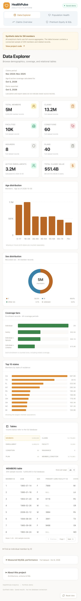
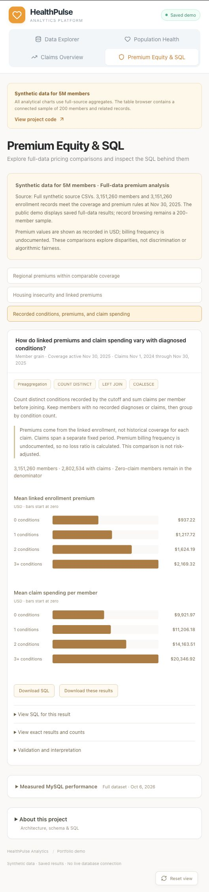
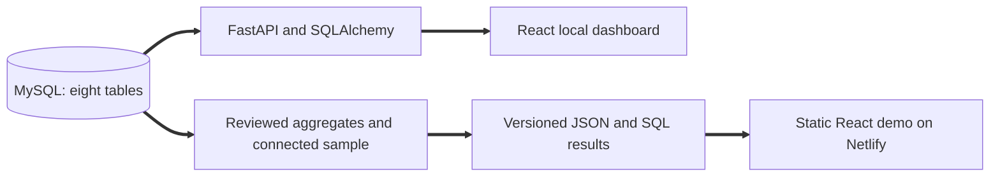

# HealthPulse: Health Insurance Analytics

[](https://github.com/emilyxue003/health_insurance_analytics/actions/workflows/ci.yml)

**[Open the live demo](https://healthpulse-analytics.netlify.app/)** · [SQL case studies](frontend/public/sql/README.md) · [Database setup](database/README.md) · [Performance evidence](docs/performance.md)

A MySQL analytics project exploring health insurance premiums, population health, and claim spending using synthetic data for **5 million members**. The full database contains **32.4 million records across eight related tables**. A React dashboard makes the analyses inspectable through charts, SQL downloads, result exports, and query plans.

## Start here

1. Open the demo and select **Premium Equity & SQL**.
2. Explore regional premiums, housing insecurity, or recorded conditions and claim spending.
3. Expand **View SQL for this result** to inspect the query and parameters.
4. Expand **Measured MySQL performance** to see tested improvements, rejected alternatives, and execution plans.

The hosted demo uses saved full-source aggregates. Its table browser contains a connected sample of 200 members and related records. The local dashboard queries MySQL directly. All data is synthetic.

## Analytical questions and technical work

| Question | Implementation | Code |
| :- | :- | :- |
| Do premiums differ by state within the same plan and coverage tier? | Grouped CTEs, weighted peer means, window functions, and `DENSE_RANK`; preserve enrollment weights when reducing calculation volume. | [Regional SQL](frontend/public/sql/regional_premiums.sql) |
| Do linked premiums differ by housing insecurity within comparable coverage? | Conditional aggregation and common weights across overlapping plan/tier cells. | [Housing SQL](frontend/public/sql/housing_premiums.sql) |
| How do premiums and claim spending vary with recorded conditions? | `COUNT DISTINCT`, separate diagnosis and claims aggregation, and `LEFT JOIN` to prevent row multiplication and retain zero-claim members. | [Conditions SQL](frontend/public/sql/conditions_costs.sql) |

Additional work includes relational schema design with foreign keys and a composite diagnosis key, parameterized queries, bounded cursor pagination, read-only analytical transactions, a five-minute process cache, and tests for date boundaries, missing values, empty groups, and result reconciliation.

<details>
<summary>Dashboard screenshots</summary>

### Data Explorer



### Conditions, premiums, and claim spending



</details>

## Measured query improvements

Measured on **local MySQL 8.0.45**, October 6, 2026, using the same full dataset and fixed analytical period. Each paired trial used three repeated direct reads and checked complete result equality.

| Change | Before | After | Result |
| :- | :- | :- | :- |
| Group regional records before window calculations | 17.77 s | 7.48 s | **57.9% less query time**, identical results; applied. |
| Covering claims index on member, date, and amount | 38.19 s | 23.45 s | **38.6% less query time**, identical results; subsequently activated. |

After activation, the normal unhinted conditions query selected the covering index and measured **18.92 s**. This was a later verification, separate from the paired comparison. Member lookup and first-page access measured approximately 1 ms in the original baseline. These are database timings, excluding HTTP, browser rendering, and application caching; they are not Cloud SQL or concurrent-user benchmarks.

[Read the methods, tradeoffs, and rejected candidates](docs/performance.md), or inspect [all four raw benchmark reports](backend/benchmarks).

## Architecture



The full-source CSV fallback executes the analytical SELECTs in SQLite when MySQL is unavailable. Saved premium outputs were subsequently checked against full MySQL result checksums. Original generation metadata is preserved separately from MySQL verification.

## Run the demo locally

Requires Node.js 22 and npm. This path needs no database or credentials.

```sh
git clone https://github.com/emilyxue003/health_insurance_analytics.git
cd health_insurance_analytics/frontend
npm ci
npm run build:demo
npm run preview:demo
```

Open `http://127.0.0.1:5174`. To run the frontend in development with saved data, use `npm run dev` and open `http://localhost:5173/?demo=1`.

## Run with MySQL

Requires Python 3.12 and MySQL 8. [Database setup](database/README.md) creates an isolated database and loads the included connected synthetic sample. The original 32.4M-row dataset is excluded from Git; the sample supports functional review, not reproduction of full-scale timing claims.

From `backend`:

```sh
python3.12 -m venv venv
source venv/bin/activate
python -m pip install -r requirements.txt
cp .env.example .env
```

Edit `.env` with your local database settings, then run `python run_dashboard.py`. In another terminal, run `npm ci` and `npm run dev` from `frontend`; open `http://localhost:5173`. The API listens on port 8001. Its interactive documentation is at `http://127.0.0.1:8001/docs`.

[Backend routes and benchmark commands](backend/README.md) explain the analytical period and optional full-data verification. API startup does not create tables; schema setup is explicit. The API is for local development and has no public authentication layer. The hosted demo contains no live database connection.

## Validation

From `backend`, with dependencies installed and `.env` configured:

```sh
python -m unittest discover
```

From `frontend`:

```sh
npm run lint
node scripts/check-errors.mjs
npm run build
npm run build:demo
node scripts/check-demo.mjs
```

The offline suite covers analytical grain, weighted calculations, MySQL decimal result types, date boundaries, cache concurrency, cursor pagination, result exports, and timing-evidence validation. Two read-only MySQL checks are opt-in through `HEALTHPULSE_LIVE_TESTS=1`. GitHub Actions runs the offline Python suite and frontend checks, plus a separate isolated MySQL sample job that reconciles all three query results with independent Python logic.

## Interpretation limits

Premium billing frequency is undocumented, so premiums are not annualized and no claims-to-premium loss ratio is reported. Income and pricing-model outputs are unavailable. Housing insecurity is not an income measure, and diagnosis count is not clinical severity. Comparisons are descriptive and do not establish discrimination, causal effects, or algorithmic fairness. The claims source covers November 2024 through November 2025; export and calculation dates do not imply newer source records.

## Repository guide

| Location | What to review |
| :- | :- |
| [database](database) | Eight-table schema, integrity queries, and reproducible sample setup |
| [frontend/public/sql](frontend/public/sql) | Shared analytical SQL, original regional baseline, methods, and saved results |
| [backend](backend) | API, query helpers, analytical validation, exports, and tests |
| [backend/benchmarks](backend/benchmarks) | Exact SQL, timings, checksums, and `EXPLAIN ANALYZE` plans |
| [frontend/src](frontend/src) | Interactive dashboard and local/demo data modes |
| [docs/performance.md](docs/performance.md) | Optimization process and scope of the measurements |

Created by **Emily Xue**. Code is available under the [MIT License](LICENSE).
