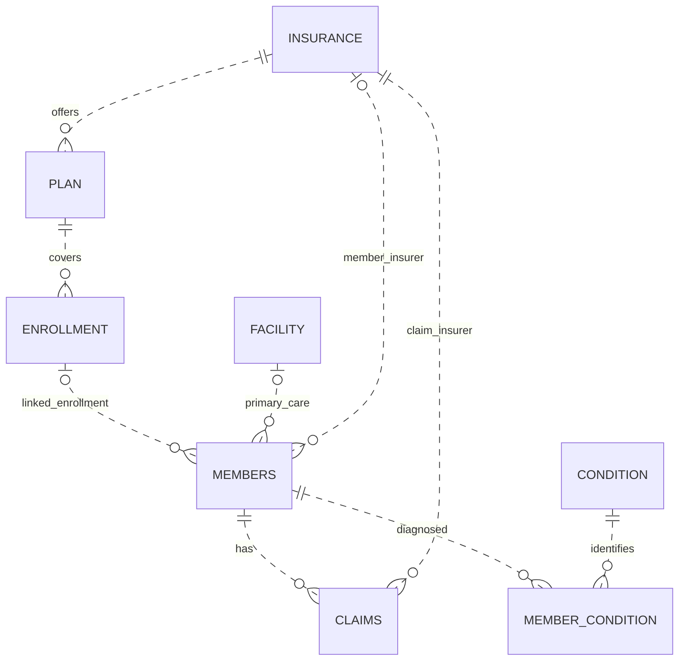

# Database setup and data scope

The full benchmark database has eight related tables and 32,400,574 synthetic records. Raw CSVs and database files are excluded from Git. The included [sample INSERTs](sample_data.sql) contain the same connected 200-member subset used by the demo's table browser.

## Schema and grain

| Table | Full-data records | Grain |
| :- | -: | :- |
| MEMBERS | 5,000,000 | Member |
| CLAIMS | 13,179,693 | Claim |
| ENROLLMENT | 4,499,910 | Enrollment record |
| MEMBER_CONDITION | 9,710,863 | Member, condition, diagnosis date |
| FACILITY | 10,000 | Facility |
| CONDITION | 60 | Condition definition |
| INSURANCE | 8 | Insurer |
| PLAN | 40 | Plan |



`MEMBER_CONDITION` has the composite primary key `(Member_ID, Condition_ID, Diagnostic_date)`, allowing repeated diagnoses on distinct dates. Several members can share an enrollment; premium analyses explicitly distinguish member weighting from enrollment weighting. The linked enrollment is not a complete coverage history for each claim.

## Run with the included sample

Use MySQL 8 and create a new isolated database named `healthpulse_sample` using your local administrator account:

```sql
CREATE DATABASE healthpulse_sample
  CHARACTER SET utf8mb4 COLLATE utf8mb4_0900_ai_ci;
```

Install the backend dependencies, copy `backend/.env.example` to `backend/.env`, and temporarily configure a local account with permission to create tables and insert records in this sample database. The example password is a placeholder; replace it locally.

From the repository root, with the backend environment activated:

```sh
python scripts/init_mysql_sample.py
python scripts/check_mysql_sample.py
```

The initializer refuses any database name other than `healthpulse_sample` and requires it to contain no tables. It creates the schema and loads the sample in dependency order. It never drops tables or overwrites an existing dataset. MySQL DDL commits implicitly, so a failed initialization may leave partially created tables; use a new empty sample database before retrying.

For normal dashboard use, switch `.env` to a local account granted only `SELECT` on `healthpulse_sample.*`. API startup does not create tables. The index-creation benchmark is a separate opt-in operation requiring additional privileges.

The sample supports functional review of relationships, SQL, API routes, and validation. Its results and timings differ from the full-data demo and benchmark evidence. Loading the sample does not reproduce the 32.4M-row measurements.

## Artifacts

- [schema.sql](schema.sql): eight-table DDL in dependency order; no table deletion.
- [sample_data.sql](sample_data.sql): generated connected synthetic sample INSERTs.
- [verify_data.sql](verify_data.sql): full-data counts and example joins; adjust its database qualifier for your database.
- `schema_final.sql`: original MySQL schema dump. It includes table deletion statements; prefer `schema.sql` for a new setup.
- `Health Insurance Data Model.mwb`: original Workbench model artifact.

Regenerate sample INSERTs from the reviewed snapshot with `python scripts/export_sample_sql.py`. The schema reflects the original constraints and indexes. The later covering-index experiment remains separate so a fresh schema does not silently claim an applied optimization.
